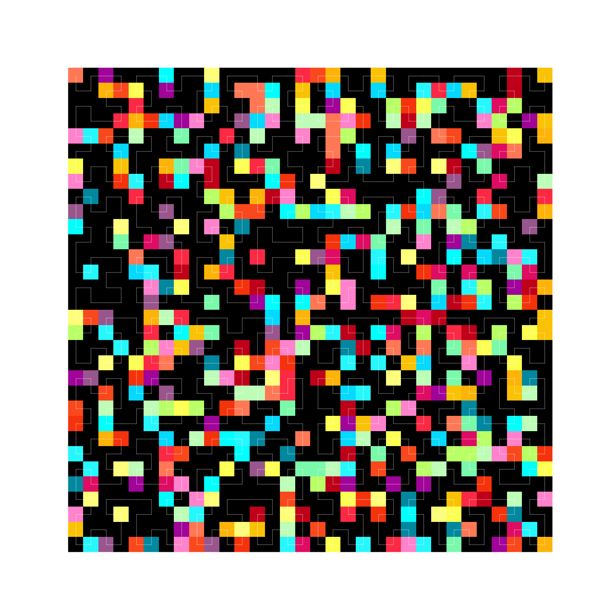

# MArt = Math + Art

This repo is dedicated to small projects which use math in some way to generate nice pictures.

_spectrumSquare.py_ randomly selects a color from a palette and places it on a grid. Inspired by Ellsworth Kelly.

- Extended to have a hilbert curve tracing through

_mesh.py_ connects equally spaced ticks on adjacent axes. Inspired by bored 2nd grade math students.

_crosshairs.py_ samples points from a unit circle and draws intersecting axis-aligned lines. Can be customized to sample different distributions within the circle.

_music.py_ plots notes with different heights and colors. No support for tempo or multiple notes at the same time. Let me know if you find any packages that do OMR (optical music recognition).

_field.py_ illustrates the shooting method of solving a boundary value problem using binary search on an angle. This is a one dimensional visualization, but may be extended to handle two dimensional acceleration fields.

_clock.py_ minimalist clock design which tries to capture the motion or passage of time in a still shot.

_strange.py_ (TODO) make a strange attractor
